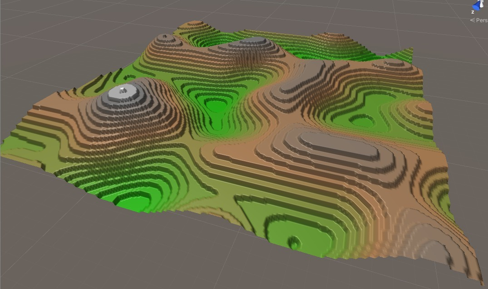
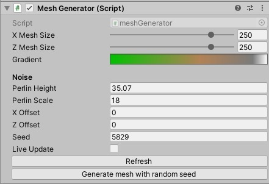

# TerrainMeshGenerator
## Procedural "Low Poly" like terrain generator.

__Preview:__

__Configurable variables:__

## You can also download just the [Unity Package](ProceduralMeshTerrain.unitypackage)

- Unity version: **2019.3.6f1**
- Render Pipeline (vertex color shader): **Universal Render Pipeline**
